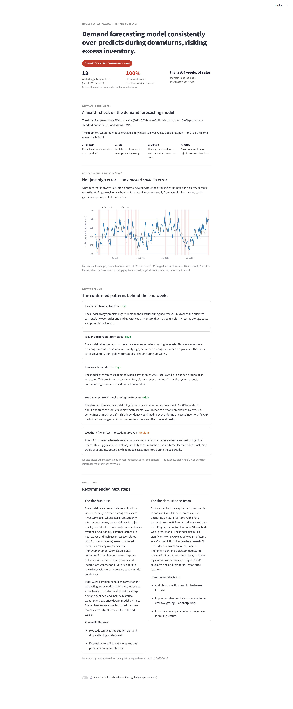

# XAI Demand Forecasting

Retrospective explainability on M5 (Walmart) weekly demand. Answers the question a business leader actually asks: **"The model performed badly at week X — why?"**

## What it does

Runs a full sliding-window backtest over 5 years of Walmart CA_1 store sales (~3,049 SKUs, ~120 weeks). For every week where the model's WMAPE spikes anomalously, it produces three types of explanation for the top-50 worst SKUs:

- **SHAP** — which features drove the prediction up or down (with full waterfall reconciliation to the prediction)
- **Counterfactual** — "if there had been no SNAP/event/price change, how different would the forecast have been?"
- **Contrastive** — "compared to a similar week where the model got it right, what was structurally different?"

Explanations use the exact retrain checkpoint that produced each week's forecast — not a single final model — so they are faithful to what the model knew at the time. An evidence-first LLM agent chain (DeepSeek Flash + Pro critic) then synthesises findings into a management-ready briefing.

## Screenshots

**Code walkthrough app** (`code_review.py` — port 7501)



## Setup

```bash
# Install dependencies
uv sync

# Set DeepSeek API key (required for insights — pipeline fails loudly without it)
cp .env.example .env
# Edit .env and set DEEPSEEK_API_KEY

# Download M5 data and ingest into SQLite (run once)
uv run python ingest.py

# Precompute feature store (run once; re-run whenever features.py changes)
uv run python build_features.py

# Sanity check before full run
uv run python smoke_test.py

# Full backtest (~120 weeks, ~30 retrains)
uv run python backtest.py

# SHAP / counterfactual / contrastive explanations
uv run python run_xai.py

# Evidence-first insights — LLM agent chain writes to insight_findings + insight_summary
uv run python generate_insights.py

# Post-run data quality checks
uv run python data_quality.py

# Launch management dashboard
uv run streamlit run app.py

# Launch code walkthrough app (separate port)
uv run streamlit run code_review.py --server.port 7501
```

## Pipeline

```
ingest.py             M5 CSVs → SQLite (weekly_sales, calendar, prices, item_meta)
build_features.py     Precompute all features once → features table (847k rows, ~46s)
smoke_test.py         Sanity check: feature staleness, contrastive, SHAP additivity, API probe
backtest.py           Sliding-window train/forecast/evaluate → forecasts, evaluations tables
                      Saves per-retrain LightGBM checkpoints + week_to_cutoff.json
run_xai.py            SHAP / counterfactual / contrastive → xai_results table (re-runnable)
generate_insights.py  Evidence-first agent chain → insight_findings, insight_summary (re-runnable)
data_quality.py       Integrity checks: h1>=0, XAI referential integrity, pre-launch leakage
app.py                Management storytelling dashboard (single page, localhost:8501)
code_review.py        Code walkthrough app (localhost:7501)
```

Each stage is independently re-runnable. If only insights need fixing, re-run `generate_insights.py` alone.

## Model

- **Algorithm:** LightGBM, Tweedie objective (variance_power=1.5) — correct for 64% zero-sale intermittent data
- **Scope:** One global model across all SKUs; CA_1 store only
- **Training window:** 3-year (156-week) sliding, retrained every 4 weeks (~30 retrains total)
- **XAI model:** Each bad week explained by its own retrain checkpoint
- **Features (19):** lag_1/2/4/8/52, rolling means/std (4/8/13 weeks), week-of-year, month, year, SNAP, event flags, sell price, price change %, dept/cat mean sales
- **Bad week flag:** WMAPE z-score ≥ 1.5 on a prior-weeks-only 8-week rolling baseline

## Dashboard (`app.py`)

Single-page management briefing. Reads top-to-bottom as a self-contained story:

| Section | What it shows |
|---|---|
| Verdict (hero) | Bold one-line verdict + risk badge + 3 live tiles (bad-week count, % over-forecast, main driver) |
| What am I looking at? | Dataset, the core question, the 4-step approach |
| How we flag a bad week | Actual vs forecast time series with bad weeks shaded |
| What we found | Accepted findings as plain-language story cards, strongest first |
| What to do | Business recommendations + DS recommended actions |
| Technical evidence | Findings ledger + per-item SHAP / counterfactual / contrastive (toggle, off by default) |

## Insights module (`xai_forecast/insights/`)

Evidence-first agent chain powered by LangGraph:

1. **Detectors** — deterministic rules fire on real data thresholds (over-forecast bias, dominant driver, demand cliff, SNAP effect, contrastive gap, external coincidence)
2. **Planner** — Flash decides which read-tools to call per finding
3. **Hypothesis** — Flash writes a structured explanation grounded in the evidence
4. **Critic** — Pro reviews and accepts/rejects; grounding issues are advisory input, not a gate
5. **Synthesis** — Flash summarises into DS-facing and business-facing perspectives

Requires `DEEPSEEK_API_KEY`. Fails loudly if absent. Full agent trace logged to `logs/insights.log`.

## Testing

```bash
uv run pytest          # 84 tests, ~4s
```

| Group | Covers |
|---|---|
| A — features | Lag correctness, rolling leakage, bfill regression, future-invariance |
| B — evaluate | WMAPE formula, z-score, NaN propagation |
| C — XAI payloads | SHAP/CF payload contract, additivity, JSON round-trip |
| D — DB | INSERT OR REPLACE idempotency, read-back, clean-slate DELETE |
| Contrastive | Same-WOY selection, skip-when-no-match, shap_diff math |
| Correctness | Baseline shift(1) property, NaN forecast handling, end-to-end mini-backtest |
| Insights | Detector contracts, tool read functions, DB round-trip, graph smoke |

## Stack

- Python 3.11+ with `uv`
- LightGBM + SHAP
- SQLite (WAL mode)
- Streamlit + Plotly
- LangGraph (insights orchestration)
- DeepSeek V4 Flash + V4 Pro via `openai` SDK (insights — mandatory)

## Data

M5 Forecasting Competition dataset (Walmart sales 2011–2016). Downloaded automatically by `ingest.py` from Kaggle. Raw files and the SQLite database are gitignored.
